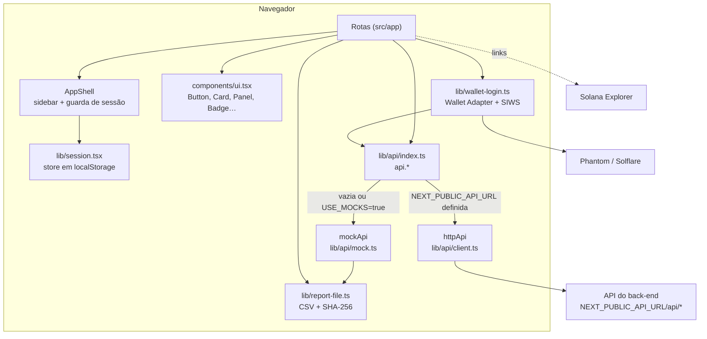
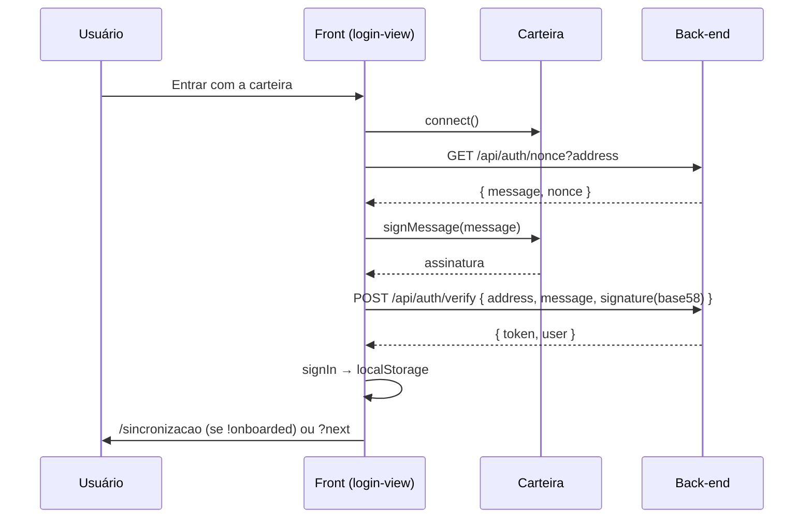
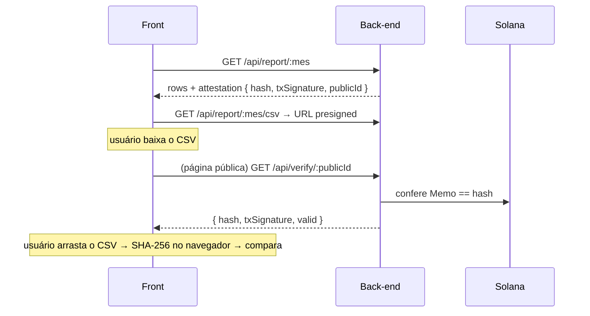

# Codebase Map

> Revisão incremental manual: 01/10/2026. As métricas do cabeçalho pertencem ao último mapeamento automatizado, não foram recalculadas nesta revisão.

## Componentes visuais adicionados na revisão de 01/10

| Arquivo | Responsabilidade |
| --- | --- |
| `components/star-field.tsx` | Três camadas de estrelas com posições determinísticas e animação CSS no login |
| `components/typewriter-text.tsx` | Revelação progressiva de texto, espera pela splash e redução de movimento |
| `components/login-planet.tsx` | Planeta GLB de 112px exclusivo do login; Three.js sob demanda, rotação lenta e fallback |
| `components/orbix-signature.tsx` | Assinatura traduzida com ponto dourado e `lab` lilás `#B3A0F4` |
| `components/splash-screen.tsx`, `components/splash-logo.tsx` | Abertura (~2,5 s) na primeira carga de cada aba (`sessionStorage["orbix.splash"]` + script no `<head>` do layout), etapas de progresso, logo OD em 3D; pula com clique/Esc; some com redução de movimento |
| `components/welcome-screen.tsx`, `welcome-logo.tsx`, `welcome-screen.module.css` | Boas-vindas (~2,6 s) depois da sincronização, só ao clicar em "Ir para o painel" e só na primeira vez neste navegador (`localStorage["orbix.welcome"]`, via `shouldPlayWelcome()`); pula com clique/Esc; some com redução de movimento. O canvas 3D cobre a tela inteira; a caixa `.model` só define onde a logo fica em repouso. Na saída a logo acelera até a câmera e atravessa a tela, sem corte nas bordas |
| `lib/i18n/`, `components/language-switch.tsx` | Dicionários PT/EN, contexto, escolha de idioma no servidor/cliente e seletor |
| `app/globals.css` | Tokens de marca, escala `type-display`/`type-h1`/`type-h2`/`type-h3`, estrelas e divisor do login |

Assets servidos: `public/od-logo.glb` (abertura), `public/voxel-planet-orbits.glb` (login) e `public/orbix-declare.glb` (boas-vindas, ~5,8 MB). Referências de vídeo/modelo ficam em `docs/`. O guia visual atual é [`BRAND_GUIDE.md`](BRAND_GUIDE.md); os mockups HTML e prints antigos foram removidos da árvore de trabalho.

> Gerado pelo Cartographer. Último mapeamento: 2026-10-01T00:49:59Z.
> Front-end do Orbix Declare (Next.js 16 + React 19 + TypeScript + Tailwind 4). O back-end fica em outro repositório.

## Visão geral



## Estrutura

```
src/
├── app/
│   ├── layout.tsx               raiz: fontes, metadata e idioma (cookie; padrão inglês) → <Providers locale>
│   ├── globals.css              tokens claro/escuro (valores dos mockups) → utilitários Tailwind
│   ├── page.tsx                 redirect("/painel")
│   ├── error.tsx, not-found.tsx
│   ├── login/                   page.tsx (Suspense) + login-view.tsx
│   ├── sincronizacao/           page.tsx + sync-view.tsx (polling de status)
│   ├── (app)/                   área logada; layout.tsx = <AppShell>
│   │   ├── painel/              page.tsx (Suspense) + dashboard-view.tsx
│   │   ├── carteiras/page.tsx
│   │   ├── relatorios/page.tsx  e  relatorios/[mes]/page.tsx
│   │   ├── agente/page.tsx      (full-bleed, sem padding do shell)
│   │   └── configuracoes/page.tsx
│   └── v/[id]/                  verificação pública: page.tsx (server) + verify-view.tsx
├── components/
│   ├── ui.tsx                   design system mínimo (client)
│   ├── app-shell.tsx            sidebar desktop + gaveta mobile + guarda de sessão
│   ├── table.tsx                <Table>/<Td> no padrão dos mockups
│   ├── month-picker.tsx, price-dialog.tsx, language-switch.tsx (PT | EN)
│   ├── event-dialog.tsx         detalhes do evento (origem, valores, preço, pendências; "Indisponível" se faltar dado)
│   ├── demo-notice.tsx          aviso de dados simulados (só no modo demonstração)
│   ├── splash-screen.tsx, splash-logo.tsx   abertura + logo 3D (three.js, public/od-logo.glb)
│   └── providers.tsx            I18nProvider → ThemeProvider → ConnectionProvider → WalletProvider → SessionProvider
└── lib/
    ├── api/{index,types,client,mock}.ts
    ├── session.tsx, wallet-login.ts, use-api.ts
    ├── report-file.ts, format.ts, config.ts
    ├── i18n/{index.tsx, locale.ts, server.ts, messages/{pt,en}.ts}   idiomas PT/EN
docs/  API_CONTRACT.md · RELATORIO_DESENVOLVIMENTO.md · CODEBASE_MAP.md · BRAND_GUIDE.md (vídeos de referência *.mp4 ficam só local)
```

## Módulos

### API (`src/lib/api/`)
| Arquivo | Papel |
|---|---|
| `index.ts` | `api = config.useMocks ? mockApi : httpApi`. Define as 20 rotas (tabela em `docs/API_CONTRACT.md`). `Api = typeof httpApi`, então o mock precisa ter o mesmo formato. |
| `types.ts` | contrato de dados: BRL como `number`, datas ISO UTC, mês `"AAAA-MM"` |
| `client.ts` | `http()`: Bearer token, `credentials: "omit"`, erro `{error:{code,message}}` → `ApiError`; 401 **com sessão ativa** → encerra a sessão |
| `mock.ts` | back-end simulado em memória: dados de set/2026 do mockup, escalados para os outros meses; sincronização de 14 s via `sessionStorage`; hash real do CSV |

### Sessão e login
- `session.tsx`: store externo + `useSyncExternalStore`. No servidor o status é `loading` (evita erro de hidratação). Sincroniza entre abas pelo evento `storage`. Chave: `localStorage["orbix.session"]`.
- `wallet-login.ts`: `useWalletLogin()` faz select → connect → `getNonce` → `signMessage` → `verify(bs58)` → `signIn`. As carteiras vêm do Wallet Standard (`wallets=[]`).
- `app-shell.tsx`: sem sessão, vai para `/login?next=<caminho+query>`. `FULL_BLEED = ["/agente"]`.

### Dados nas telas
- `use-api.ts`: `useApi(fetcher, deps, enabled)` devolve `{data, error, loading, reload, setData}`. A chave é `JSON.stringify(deps)#nonce`, os dados antigos continuam visíveis enquanto recarrega e respostas antigas são descartadas.

### Arquivo e hash
- `report-file.ts`: `reportToCsv` (cabeçalho fixo, `,`, `\n`, sem BOM, data no fuso de Brasília), `sha256Hex` (`crypto.subtle`), `downloadText` e `triggerDownload`.

## Fluxos

### Login (Sign-In With Solana)


### Sincronização
`POST /api/ingest` uma vez, depois `GET /api/ingest/status` a cada 1,5 s até `done` (atualiza `user.onboarded`) ou `error` (para e mostra "Tentar de novo").

### Relatório → verificação pública


## Convenções

- Interface em PT e EN: nenhum texto fixo nos componentes; tudo vem de `t` (`useI18n()`, ou `getMessages()` em Server Components). Erros dizem o que houve e como resolver.
- Cores só por token (`bg-card`, `text-muted`, `border-line2`…). A paleta `brand-*` é fixa: a sidebar e o painel do login ficam escuros nos dois temas.
- Rótulos em mono maiúsculo com `<Kicker>`; títulos em `font-display` (Outfit).
- Ícones Phosphor, sempre os nomes `*Icon`.
- Telas com `useSearchParams` ficam dentro de `<Suspense>` (`painel`, `login`).
- Next 16: `params` é Promise. `LayoutProps`/`PageProps` são globais e vêm do `next typegen` (rode `npm run typecheck`).

## Pegadinhas

- `config` é resolvido **no build** (`NEXT_PUBLIC_*`): trocar a variável exige um novo build.
- `crypto.subtle` só existe em HTTPS ou em localhost. A verificação do arquivo e o hash do modo demo falham em HTTP puro.
- `table.tsx` importa `cn` de `ui.tsx` (client); use a tabela só em componentes client.
- O histórico do Agente IA fica só no estado do componente e se perde ao navegar.
- `decriptoDeadline` (relatórios) considera fim de semana, mas não feriados.
- Os dados do mock são ilustrativos. O imposto do mock é uma regra simplificada (15% acima de R$ 35 mil) e o contexto do agente sempre cita março.
- Download real usa `a.download` numa URL presigned de outra origem; o nome do arquivo vem do `Content-Disposition` do back-end.
- O idioma atual também vive num valor de módulo (`lib/i18n/locale.ts`), atualizado pelo `I18nProvider` a cada render: é assim que `format.ts`, o cliente HTTP e o mock sabem o idioma sem React.
- Ler o cookie de idioma no `app/layout.tsx` torna as rotas dinâmicas (renderizadas por requisição), o que é esperado.

## Onde mexer

| Tarefa | Arquivos |
|---|---|
| Nova rota da API | `lib/api/types.ts` → `httpApi` em `lib/api/index.ts` → `mockApi` em `lib/api/mock.ts` → `docs/API_CONTRACT.md` |
| Nova tela logada | `src/app/(app)/<rota>/page.tsx` + item em `NAV` (`components/app-shell.tsx`) |
| Novo componente visual | `components/ui.tsx` (ou arquivo próprio em `components/`) |
| Cores e tema | `src/app/globals.css` (`:root`, `[data-theme="dark"]`, `@theme inline`) |
| Login e sessão | `lib/wallet-login.ts`, `lib/session.tsx`, `lib/api/client.ts` |
| Formato de número ou data | `lib/format.ts` |
| Texto da interface (PT/EN) | `lib/i18n/messages/pt.ts` + `en.ts` (mesmas chaves) |
| Regras do CSV e do hash | `lib/report-file.ts` (o back-end precisa seguir as mesmas regras) |
